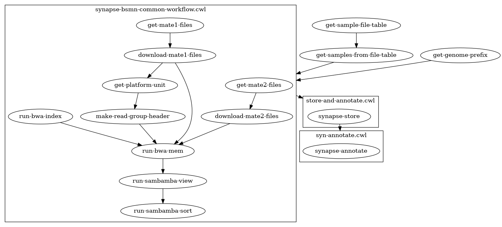

# bsmn-common-workflow
The BSMN common workflow implemented in the Common Workflow Language.

This pipeline is an implementation of an existing pipeline available at https://github.com/bsmn/bsmn-pipeline.

# Requirements

## Common Workflow Language

This implementation requires a CWL interpreter to run. The most basic of these is the CWL reference implementation, available from https://github.com/common-workflow-language/cwltool. See the documentation on that page for installation, which requires Python.

## Data
This implementation currently requires data files to be stored and index in [Synapse](https://www.synapse.org). It uses `fastq` files as inputs, which need to be index in a table or file view and annotated with `specimenID`, `readPair = [1,2]`, and `fileFormat = 'fastq'`.

It also requires a reference genome (prefix file for BWA) to be accessible in Synapse. This requires a Synapse account.

# Instructions

1. Download or clone this repository, and change to the directory that it is stored in.
2. Modify the file [test-workflow-entrypoint.json](test-workflow-entrypoint.json) file to point to your own Synapse configuration file.

You can now run:

```
cwl-runner workflow-entrypoint.cwl test-workflow-entrypoint.json
```

# Current workflow


